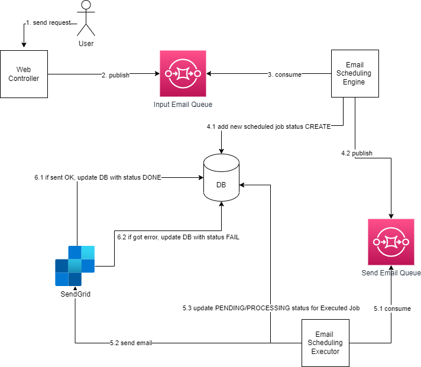
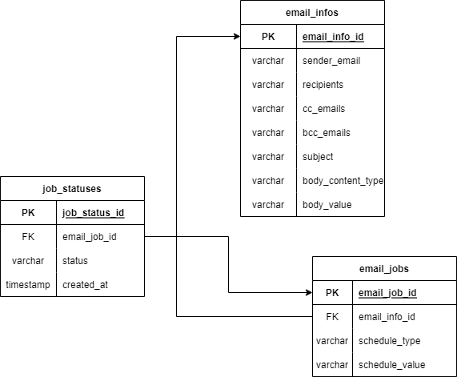

# Email Scheduler Service
This is a service that schedules emails to be sent at a later time. 
The service is built using the Spring Boot framework with Kotlin 
as the programming language. It uses PostgreSQL as the database, 
AWS SQS as the message queue, Quartz Scheduler
and SendGrid as the email service.

## System Architecture Design

### Components
- Input Queue: This component receives timer creation requests. Each request includes the timer's type, value, and the job details.
- Scheduling Engine: This component takes timer creation requests from the Input Queue and schedules jobs based on the timer's type and value. It ensures that jobs are scheduled within seconds of their scheduled time and outputs the jobs into another queue.
- Job Queue: This component holds the jobs that are ready to be executed. The actual executor pulls jobs from this queue.
- Job Executor: This component executes jobs that are pulled from the Job Queue.
- Database: This component stores timer creation requests, scheduled jobs, and executed jobs. It ensures reliability and enables flexibility by allowing users to change or cancel timers on the fly.
### Flow Diagram:
Here's a flow diagram that shows how the components are wired together:

### Database Schema Design:
The following tables can be created to store schedule email requests, scheduled jobs, and executed jobs status:

### Framework & Library:
Here are the frameworks and libraries used in this service:

- Spring Boot: is an open-source framework for building Java-based applications. It is designed to simplify the development process by providing a set of pre-configured components that can be easily integrated into an application. In this service, we used Spring Boot to create RESTful APIs, handle HTTP requests and responses, and manage database transactions.

- Kotlin: is a statically typed programming language that runs on the Java Virtual Machine (JVM). It is designed to be more concise, expressive, and safe than Java. In this service, we used Kotlin as the programming language to write our code.

- PostgreSQL: is an open-source relational database management system (RDBMS). It is known for its scalability, performance, and reliability. In this service, we used PostgreSQL as the database to store job details.

- AWS SQS (Simple Queue Service): is a fully managed message queue service that enables decoupling and scaling of microservices, distributed systems, and serverless applications. In this service, we used AWS SQS as the message queue to store and retrieve job requests.

- SendGrid: is a cloud-based email service that provides reliable email delivery, scalability, and analytics. In this service, we used SendGrid as the email service to send scheduled emails.

- Quartz Scheduler: is a widely used, open-source job scheduling library that allows developers to schedule and manage jobs within their Java applications. It supports various job scheduling techniques such as cron-like expressions, simple triggers, and more.
Quartz Scheduler is a powerful and flexible library that can help developers manage job scheduling within their applications with ease.

- Conclusion
In this service, we used a combination of popular frameworks and libraries to build a scalable and reliable email scheduler. With Spring Boot, Kotlin, PostgreSQL, AWS SQS, SendGrid,... we were able to create a robust and maintainable codebase.

## Reference Documentation

For further reference, please consider the following sections:

* [Official Gradle documentation](https://docs.gradle.org)
* [Spring Boot Gradle Plugin Reference Guide](https://docs.spring.io/spring-boot/docs/3.0.6/gradle-plugin/reference/html/)
* [Create an OCI image](https://docs.spring.io/spring-boot/docs/3.0.6/gradle-plugin/reference/html/#build-image)
* [Spring Boot DevTools](https://docs.spring.io/spring-boot/docs/3.0.6/reference/htmlsingle/#using.devtools)
* [Spring Web](https://docs.spring.io/spring-boot/docs/3.0.6/reference/htmlsingle/#web)

### Guides

The following guides illustrate how to use some features concretely:

* [Building a RESTful Web Service](https://spring.io/guides/gs/rest-service/)
* [Serving Web Content with Spring MVC](https://spring.io/guides/gs/serving-web-content/)
* [Building REST services with Spring](https://spring.io/guides/tutorials/rest/)

### Additional Links

These additional references should also help you:

* [Gradle Build Scans – insights for your project's build](https://scans.gradle.com#gradle)

